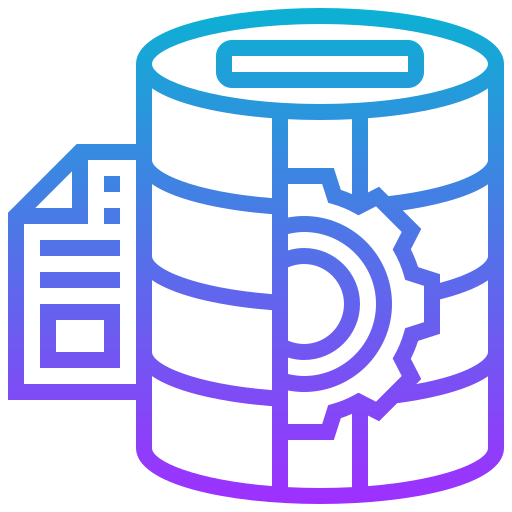

<!-- Improved compatibility of back to top link: See: https://github.com/othneildrew/Best-README-Template/pull/73 -->
<a name="readme-top"></a>
<!--
*** Thanks for checking out the Best-README-Template. If you have a suggestion
*** that would make this better, please fork the repo and create a pull request
*** or simply open an issue with the tag "enhancement".
*** Don't forget to give the project a star!
*** Thanks again! Now go create something AMAZING! :D
-->


<!-- PROJECT SHIELDS -->
<!--
*** I'm using markdown "reference style" links for readability.
*** Reference links are enclosed in brackets [ ] instead of parentheses ( ).
*** See the bottom of this document for the declaration of the reference variables
*** for contributors-url, forks-url, etc. This is an optional, concise syntax you may use.
*** https://www.markdownguide.org/basic-syntax/#reference-style-links
-->
[![Contributors][contributors-shield]][contributors-url]
[![Forks][forks-shield]][forks-url]
[![Stargazers][stars-shield]][stars-url]
[![Issues][issues-shield]][issues-url]
[![MIT License][license-shield]][license-url]
[![LinkedIn][linkedin-shield]][linkedin-url]


<!-- PROJECT LOGO -->
<br />
<div align="center">
  <a href="https://github.com/masterquiroga/billpocket-de-challenge">
    
  </a>

<h3 align="center">Billpocket DE Challenge </h3>

  <p align="center">
    Winning entry for the Billpocket Data Engineering Challenge.
    <br />
    By Víctor G. G. Quiroga
    <br />
    <a href="https://github.com/masterquiroga/billpocket-de-challenge"><strong>Explore the docs »</strong></a>
    <br />
    <br />
    <a href="https://github.com/masterquiroga/billpocket-de-challenge">View Demo</a>
    ·
    <a href="https://github.com/masterquiroga/billpocket-de-challenge/issues">Report Bug</a>
    ·
    <a href="https://github.com/masterquiroga/billpocket-de-challenge/issues">Request Feature</a>
  </p>
</div>


<!-- TABLE OF CONTENTS -->
<details>
  <summary>Table of Contents</summary>
  <ol>
    <li>
      <a href="#about-the-project">About The Project</a>
      <ul>
        <li><a href="#built-with">Built With</a></li>
      </ul>
    </li>
    <li>
      <a href="#getting-started">Getting Started</a>
      <ul>
        <li><a href="#prerequisites">Prerequisites</a></li>
        <li><a href="#installation">Installation</a></li>
      </ul>
    </li>
    <li><a href="#usage">Usage</a></li>
    <li><a href="#roadmap">Roadmap</a></li>
    <li><a href="#contributing">Contributing</a></li>
    <li><a href="#license">License</a></li>
    <li><a href="#contact">Contact</a></li>
    <li><a href="#acknowledgments">Acknowledgments</a></li>
  </ol>
</details>


<!-- ABOUT THE PROJECT -->
## About The Project

[![Product Name Screen Shot][product-screenshot]](https://github.com/masterquiroga/billpocket-de-challenge)

This is the Solution for the Billpocket Data Engineering Challenge: It consists of an IPython notebook which implements a complete PySpark ETL-based solution according to the intructions provided via E-mail in a [DOCX file](./docs/Test.docx):
>Instructions:
>
>Inside the `../data/raw/` there exists a single file in CSV format, build a Python notebook to make the following tasks:
>	- Take the value of the columns and put them in the correct format.
>	- Remove from dataset all the transactions where the chargeback is greater than the amount.
>	- What is the total amount of the completed and failed transactions?
>	- Compute the percentage of completed transactions by merchant and month.
>	- Create a flag by merchant and month that marks if the merchant had at least one transaction in each status. Use 0 to indicate that it didn't have all statuses in the given month and 1 to indicate it had them all.
>	- Through Banxico's API, fetch the exchange rate (Tipo de cambio para solventar obligaciones denominadas en moneda extranjera Fecha de determinación (FIX)). https://www.banxico.org.mx/SieAPIRest/service/v1/
>	- Transform dollar monetary amounts to pesos (Use the monthly average of exchange rates).
>	- Export the resulting DataFrame to a csv file.
>
>Considerations
>	- The transaction id column must be numeric and with unique values.
>	- The operation month column must be of date type.
>

See the  actual [Challenge Solution Notebook](./src/billpocket_de_challenge_winner.ipynb) for more.

<p align="right">(<a href="#readme-top">back to top</a>)</p>


### Built With

* [![pyenv][pyenv]][pyenv-url]
* [![Pipenv][Pipenv]][Pipenv-url]
* [![Python][Python]][Python-url]
* [![PySpark][PySpark]][PySpark-url]
* [![VSCode][VSCode]][VSCode-url]


<p align="right">(<a href="#readme-top">back to top</a>)</p>


<!-- GETTING STARTED -->
## Getting Started

To get a local copy up and running follow these simple example steps.

### Prerequisites

* pyenv
  ```sh
  export PYENV_GIT_TAG=v2.3.3
  curl https://pyenv.run | bash
  exec $SHELL
  ```
More detailed installation instructions can be found in the [pyenv documentation](https://github.com/pyenv/pyenv#installation).

* Python
  ```
  pyenv install 3.10.6
  pyenv local 3.10.6
  ```

* Pipenv
    ```sh
    pip install -U pipenv
    ```
More detailed installation instructions can be found in the [Pipenv documentation](https://pipenv.pypa.io/en/latest/install/#installing-pipenv).


### Installation

1. Get a free Banxico SIE API Token at [https://www.banxico.org.mx/SieAPIRest/service/v1/token](https://www.banxico.org.mx/SieAPIRest/service/v1/token)
2. Clone the repo:
   ```sh
   git clone https://github.com/masterquiroga/billpocket-de-challenge.git && cd "$(basename "$_" .git)"
   ```
3. Activate python version:
    ```sh
    pyenv local 3.10.6
    ```
3. Install python dependencies:
   ```sh
   pipenv install --python $(cat .python-version)
   ```
4. Enter your Banxico SIE API Token in `.env`:
   ```sh
   BANXICO_API_TOKEN="[YOUR_API_TOKEN]"
   ```

<p align="right">(<a href="#readme-top">back to top</a>)</p>


<!-- USAGE EXAMPLES -->
## Usage

_For usage examples, please refer to the actual [Challenge Solution Noteboook](./src/billpocket_de_challenge_winner.ipynb)_

<p align="right">(<a href="#readme-top">back to top</a>)</p>


<!-- ROADMAP -->
## Roadmap

- [*] Take the value of the columns and put them in the correct format.
- [*] Remove from dataset all the transactions where the chargeback is greater than the amount.
- [*] What is the total amount of the completed and failed transactions?
- [*] Compute the percentage of completed transactions by merchant and month.
- [*] Create a flag by merchant and month that marks if the merchant had at least one transaction in each status. Use 0 to indicate that it didn't have all statuses in the given month and 1 to indicate it had them all.
- [*] Through Banxico's API, fetch the exchange rate (Tipo de cambio para solventar obligaciones denominadas en moneda extranjera Fecha de determinación (FIX)). https://www.banxico.org.mx/SieAPIRest/service/v1/
- [*] Transform dollar monetary amounts to pesos (Use the monthly average of exchange rates).
- [*] Export the resulting DataFrame to a csv file.
- [*] Make the coolest solution for this challenge.

See the [open issues](https://github.com/masterquiroga/billpocket-de-challenge/issues) for a full list of proposed features (and known issues).

<p align="right">(<a href="#readme-top">back to top</a>)</p>


<!-- CONTRIBUTING -->
## Contributing

Contributions are what make the open source community such an amazing place to learn, inspire, and create. Any contributions you make are **greatly appreciated**.

If you have a suggestion that would make this better, please fork the repo and create a pull request. You can also simply open an issue with the tag "enhancement".
Don't forget to give the project a star! Thanks again!

1. Fork the Project
2. Create your Feature Branch (`git checkout -b feature/AmazingFeature`)
3. Commit your Changes (`git commit -m 'Add some AmazingFeature'`)
4. Push to the Branch (`git push origin feature/AmazingFeature`)
5. Open a Pull Request

<p align="right">(<a href="#readme-top">back to top</a>)</p>


<!-- LICENSE -->
## License

Distributed under the MIT License. See the [`LICENSE`](./LICENSE) file for more information.

<p align="right">(<a href="#readme-top">back to top</a>)</p>


<!-- CONTACT -->
## Contact

[Víctor Gerardo González Quiroga](https://linkedin.com/in/masterquiroga) for the full ownership of this project.

Project Link: [https://github.com/masterquiroga/billpocket-de-challenge](https://github.com/masterquiroga/billpocket-de-challenge)

<p align="right">(<a href="#readme-top">back to top</a>)</p>


<!-- ACKNOWLEDGMENTS -->
## Acknowledgments

* [Carlos Alberto Wong Almaraz](https://www.linkedin.com/in/carlos-alberto-wong-almaraz-5502a3220) for the invitation to this challenge.
* [Emanuel Cruz Jiménez](https://www.linkedin.com/in/emmanuelcj) for the technical validation of this challenge.

<p align="right">(<a href="#readme-top">back to top</a>)</p>


<!-- MARKDOWN LINKS & IMAGES -->
<!-- https://www.markdownguide.org/basic-syntax/#reference-style-links -->
[contributors-shield]: https://img.shields.io/github/contributors/masterquiroga/billpocket-de-challenge.svg?style=for-the-badge
[contributors-url]: https://github.com/masterquiroga/billpocket-de-challenge/graphs/contributors
[forks-shield]: https://img.shields.io/github/forks/masterquiroga/billpocket-de-challenge.svg?style=for-the-badge
[forks-url]: https://github.com/masterquiroga/billpocket-de-challenge/network/members
[stars-shield]: https://img.shields.io/github/stars/masterquiroga/billpocket-de-challenge.svg?style=for-the-badge
[stars-url]: https://github.com/masterquiroga/billpocket-de-challenge/stargazers
[issues-shield]: https://img.shields.io/github/issues/masterquiroga/billpocket-de-challenge.svg?style=for-the-badge
[issues-url]: https://github.com/masterquiroga/billpocket-de-challenge/issues
[license-shield]: https://img.shields.io/github/license/masterquiroga/billpocket-de-challenge.svg?style=for-the-badge
[license-url]: https://github.com/masterquiroga/billpocket-de-challenge/blob/master/LICENSE.txt
[linkedin-shield]: https://img.shields.io/badge/-LinkedIn-blue.svg?style=for-the-badge&logo=linkedin&colorB=blue
[linkedin-url]: https://linkedin.com/in/masterquiroga
[product-screenshot]: images/screenshot.png

[pyenv]: https://img.shields.io/badge/2.3.3-444444?style=for-the-badge&logo=pypy&logoColor=yellow&label=pyenv&labelColor=193440
[pyenv-url]: https://github.com/pyenv/pyenv

[Pipenv]: https://img.shields.io/badge/2022.8.24-444444?style=for-the-badge&logo=pypi&logoColor=white&label=pipenv&labelColor=222222
[Pipenv-url]: https://pipenv.pypa.io

[Python]: https://img.shields.io/badge/3.10.6-444444?style=for-the-badge&logo=python&logoColor=ffd343&label=Python&labelColor=3776AB
[Python-url]: https://python.org

[PySpark]: https://img.shields.io/badge/3.3.0-444444?style=for-the-badge&logo=apachespark&logoColor=orange&label=PySpark&labelColor=1B5162
[PySpark-url]: https://spark.apache.org/docs/3.3.0/api/python/

[VSCode]: https://img.shields.io/badge/1.70.2-444444?style=for-the-badge&logo=visualstudiocode&logoColor=white&label=VSCode&labelColor=007ACC
[VSCode-url]: https://code.visualstudio.com/

[Next.js]: https://img.shields.io/badge/next.js-000000?style=for-the-badge&logo=nextdotjs&logoColor=white
[Next-url]: https://nextjs.org/
[React.js]: https://img.shields.io/badge/React-20232A?style=for-the-badge&logo=react&logoColor=61DAFB
[React-url]: https://reactjs.org/
[Vue.js]: https://img.shields.io/badge/Vue.js-35495E?style=for-the-badge&logo=vuedotjs&logoColor=4FC08D
[Vue-url]: https://vuejs.org/
[Angular.io]: https://img.shields.io/badge/Angular-DD0031?style=for-the-badge&logo=angular&logoColor=white
[Angular-url]: https://angular.io/
[Svelte.dev]: https://img.shields.io/badge/Svelte-4A4A55?style=for-the-badge&logo=svelte&logoColor=FF3E00
[Svelte-url]: https://svelte.dev/
[Laravel.com]: https://img.shields.io/badge/Laravel-FF2D20?style=for-the-badge&logo=laravel&logoColor=white
[Laravel-url]: https://laravel.com
[Bootstrap.com]: https://img.shields.io/badge/Bootstrap-563D7C?style=for-the-badge&logo=bootstrap&logoColor=white
[Bootstrap-url]: https://getbootstrap.com
[JQuery.com]: https://img.shields.io/badge/jQuery-0769AD?style=for-the-badge&logo=jquery&logoColor=white
[JQuery-url]: https://jquery.com 
